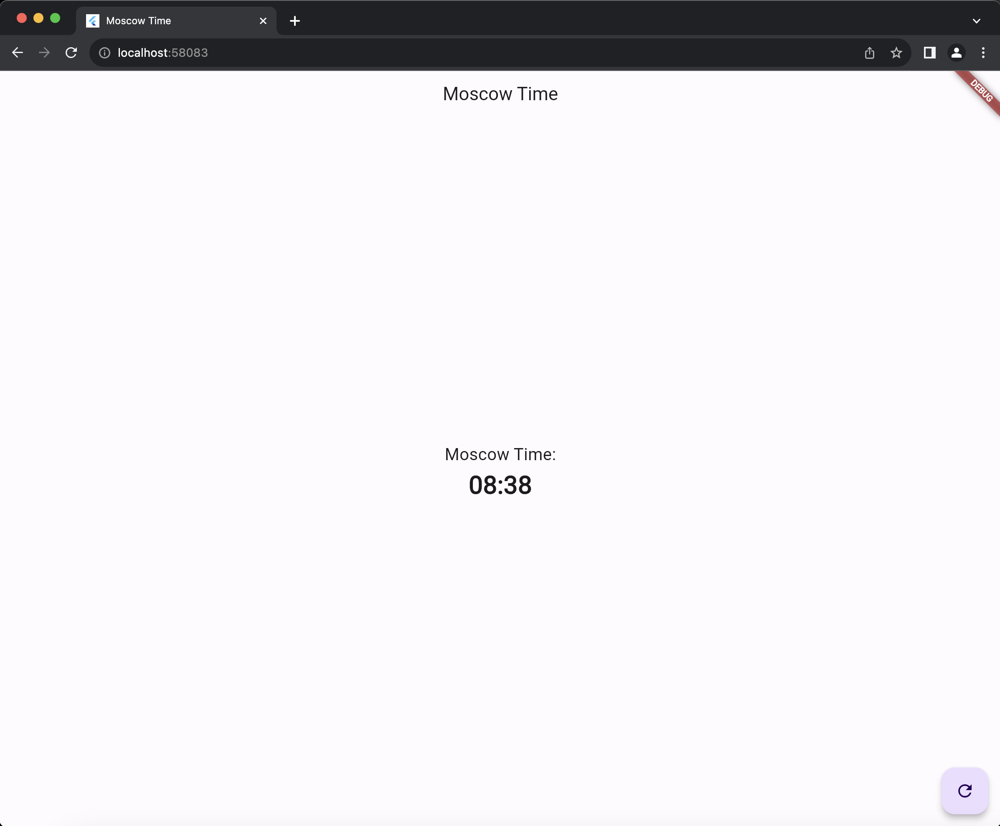

# Lab 1 python web app

## Why Flask was chosen for the assignment?

- We have to implement small quick web app.
- Its simplicity, flexibility, and ease of use. 
- It is a lightweight framework that allows for rapid development of web applications. 
- Flask is also known for its extensive documentation and strong community support, making it a popular choice for both beginners and experienced developers.
- Flask provides a wide range of extensions and libraries for various functionalities, allowing developers to easily add features to their web applications.

## Best Practices in Flask
Flask, like any other framework, has its own set of best practices to follow in order to maintain a clean and efficient codebase. Some of the best practices in Flask include:

1. **Using Virtual Environments:**   It is considered a best practice to use virtual environments, such as venv or virtualenv, to manage project dependencies. Virtual environments provide a clean and isolated environment for each project, preventing conflicts between different projects' dependencies.

2. **Code Readability and Standards:**    By following PEP 8 guidelines, developers can maintain a clean, readable, and consistent codebase, leading to improved code quality and maintainability in Flask development. This includes following naming conventions, code layout guidelines, proper imports organization, descriptive comments and docstrings, and consistent code styling.

3. **Modular design principles:**    The division into models, routes, schemas, and services follows modular design principles, allowing for better organization, reusability, and separation of concerns. This approach helps to maintain a clean and efficient codebase, with clear responsibilities for different parts of the application.

4. **Using Blueprints:**    Flask blueprints are used for organizing routes and views, making it easier to manage and scale the application. By using blueprints, developers can create modular and reusable components, leading to a more maintainable codebase.

5. **Build Your Documentation from the Code:**    It's important to provide clear documentation for developers to consume your API. One way to achieve this is by using the code to generate your documentation. In the context of Flask, you can utilize the flasgger library, which provides annotations and tools to generate documentation. Flasgger also offers a user-friendly web interface, allowing developers to view endpoints, inputs, outputs, and even run the endpoints directly from the documentation. This approach leverages the power of Swagger, an open-source specification that allows for dynamic and interactive API documentation.

By following these best practices, developers can ensure that their Flask applications are well-structured, maintainable, and scalable, leading to a better overall development experience and a more robust final product.

## What I did to follow it:

1. Configured `.venv` and `poetry` ways to use all dependencies

2. Setup `pep8` rules in IDE and changed code

3. Divided app to `model`, `route`, `schema` and `service` folders with using framework classes

4. Added a `blueprint` with api url

5. Added `flassger` as a method to documentate api of app

## Testing

All in `tests` folder. Tests for response and variability over time

## Images

## To see bonus task completion 

Go to the `app_flutter` folder and see beautifull flutter app

   

## Unit Tests for Displaying Current Time in Moscow

### Description
This module contains unit tests for the Flask application that displays the current time in Moscow.

### Test Details:

#### `test_display_time`:
- **Description**: This test checks if the current time in Moscow is displayed correctly on the webpage.
- **Steps**:
    1. Sends a GET request to the Flask application.
    2. Asserts that the response data contains the text 'The current time in Moscow: '.
    3. Retrieves the current time in Moscow and formats it to the hour, minute, and second.
    4. Asserts that the formatted time is present in the response data.

#### `test_display_time_changes`:
- **Description**: This test checks if the current time in Moscow changes after refreshing the page.
- **Steps**:
    1. Sends a GET request to the Flask application.
    2. Asserts that the response data contains the text 'The current time in Moscow: '.
    3. Retrieves the current time in Moscow and formats it to the hour, minute, and second.
    4. Asserts that the formatted time is present in the response data.
    5. Sends another GET request to the application to simulate a page refresh.
    6. Asserts that the response data still contains the text 'The current time in Moscow: '.
    7. Retrieves the current time in Moscow after the page refresh.
    8. Asserts that the new time is different from the previous time, ensuring that the time display updates correctly.
    
### Best Practices Applied

1. **Fixture for Test Client**: Using a fixture to return a test client for the Flask application to avoid code duplication and ensure a clean client for each test.

2. **Isolated Testing Environment**: Setting the `TESTING` configuration to `True` for testing and using the `with app.test_client()` context manager to ensure an isolated testing environment.

3. **Test for Displaying Time**: Checking if the current time in Moscow is displayed correctly and adhering to the best practice of descriptive test naming.

4. **Test for Time Refresh**: Checking if the current time in Moscow changes after refreshing the page and asserting that the time changes to ensure the functionality of time display update.

5. **Usage of Pytest**: Using `pytest` to run the unit tests, allowing for easy test execution and reporting.
